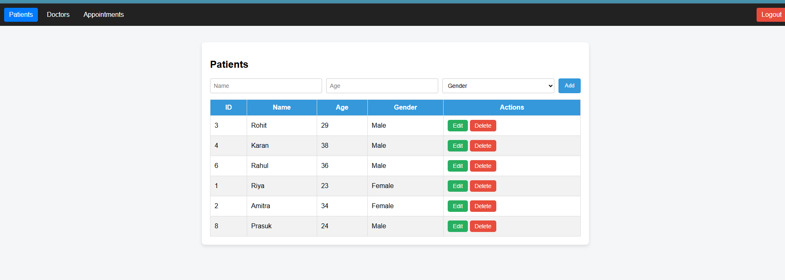
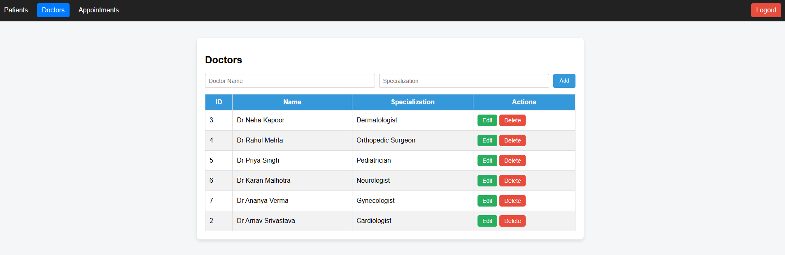
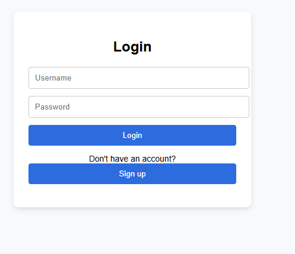
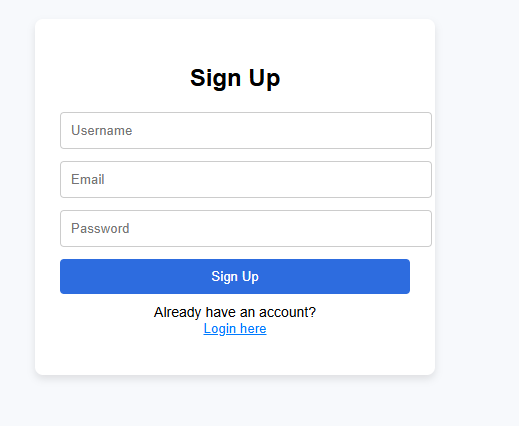

# Hospital Management System

A full-stack web application for managing hospital operations. The backend is built with Spring Boot, providing a RESTful API for CRUD (Create, Read, Update, Delete) operations, and the frontend provides the user interface to interact with the system.

## 🖼️ Project Screenshot

## ✨ Features

- **Patient Management:** Add new patients, view their details, update records, and remove them.
- **Doctor Management:** Maintain a list of doctors, their specializations, and schedules.
- **Appointment Scheduling:** Book and manage appointments between patients and doctors.
- **RESTful API:** A well-documented API for easy integration and management.

## 🛠️ Tech Stack

This project is built with the following technologies:

- **Backend:**
    - Java
    - Spring Boot (for the REST API)
    - Spring Data JPA (for database interaction)
    - Maven (for dependency management)
    - H2 / MySQL / PostgreSQL (or any JPA-supported database)

- **Frontend:**
    - HTML, CSS, JavaScript
    -React.js

The project is organized as a monorepo with the backend and frontend code in separate directories.

Created by Arnav Srivastava

